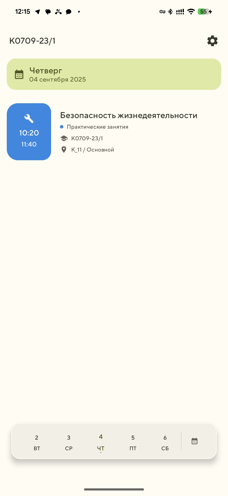
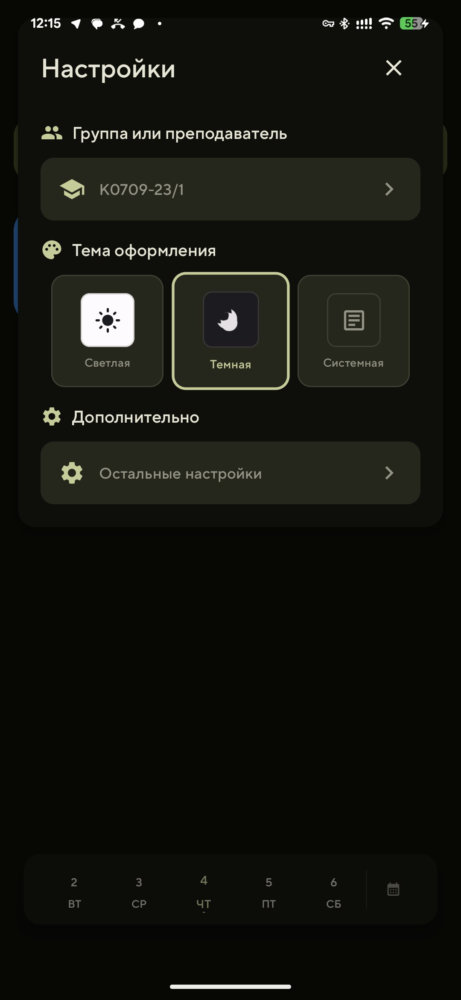
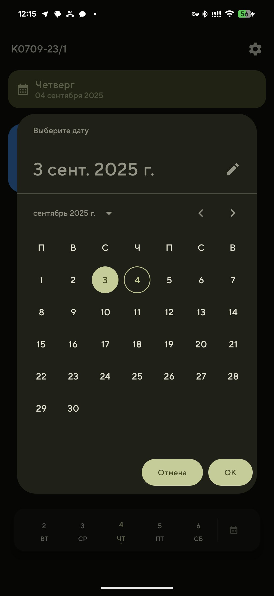
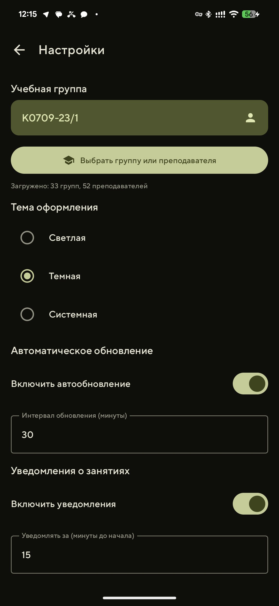
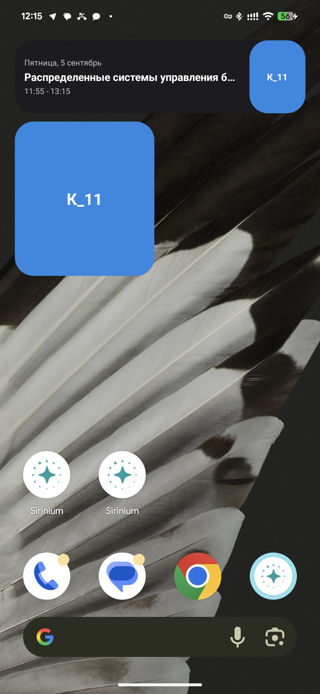
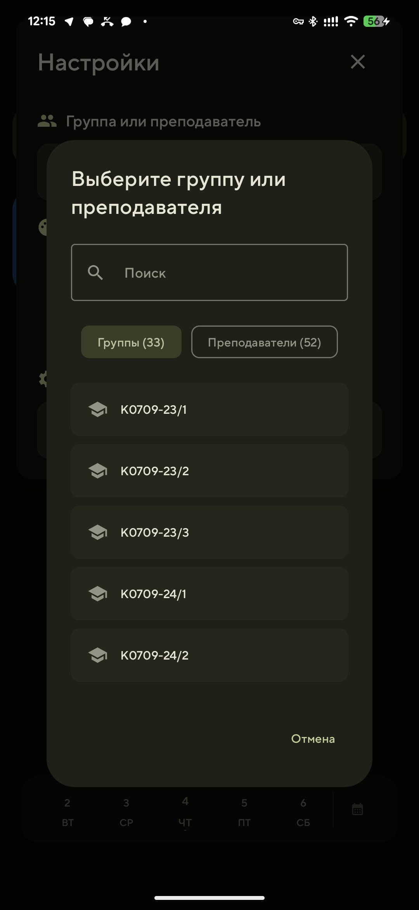
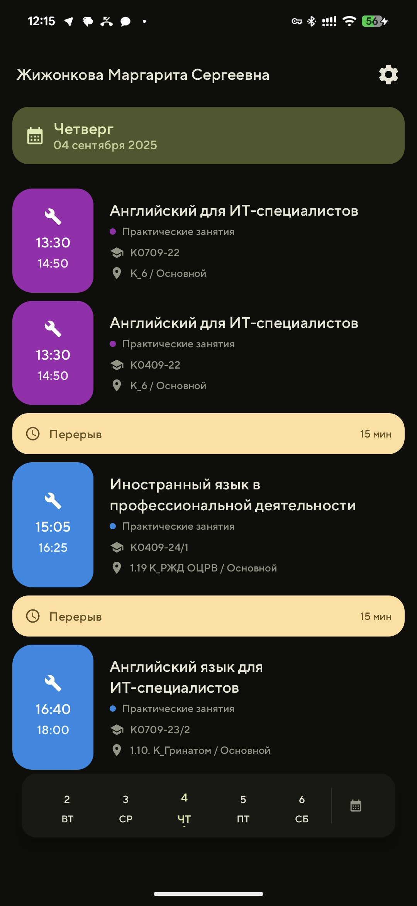

## Sirinium — расписание 

Нативное Android‑приложение для просмотра расписания учебных групп и преподавателей b виджетами «Следующая пара».

### Возможности
- Поиск и выбор группы или преподавателя
- Просмотр расписания по дням/неделям
- Виджеты 2×2 и 4×1: показывают ближайшую будущую пару
- Автообновление и уведомления перед началом пары
- Светлая/тёмная/системная тема

### Скриншоты
Файлы из каталога `images/`:

### Виджеты
- 2×2 — крупный номер аудитории с цветовой индикацией типа занятия
- 4×1 — день недели, дата, предмет, время и аудитория
- Всегда показывают ближайшую будущую пару для выбранной группы или преподавателя (если на сегодня пары закончились, показывается первая пара ближайшего дня)

### Сборка и запуск
1. Откройте проект в Android Studio
2. Установите Android SDK 24+ (целевой SDK 35)
3. Запустите конфигурацию `app` (debug/release)

### Настройки API
По умолчанию приложение обращается к API:
- `GET /api/groups` — список групп
- `GET /api/teachers` — словарь ID→ФИО
- `GET /api/schedule?group={КXXXX-..}&week={offset}` — расписание группы
- `GET /api/teacherschedule?id={teacherId}&week={offset}` — расписание преподавателя

Базовый URL настраивается в `RetrofitClient`.

### Разрешения
- INTERNET — загрузка данных расписания
- POST_NOTIFICATIONS — уведомления (Android 13+)
- RECEIVE_BOOT_COMPLETED — восстановление автообновлений после перезагрузки

### Технологии
- Kotlin, Jetpack Compose, Material 3
- WorkManager, Room, DataStore
- Retrofit/OkHttp
- App Widgets

### Вклад и ошибки
PR и Issues приветствуются. Если нашли баг:
- опишите шаги воспроизведения;
- приложите логи (Logcat) и скрин/видео.

### Лицензия
MIT.

## Разработчики
https://github.com/alphadvolj
https://github.com/nnqnn

